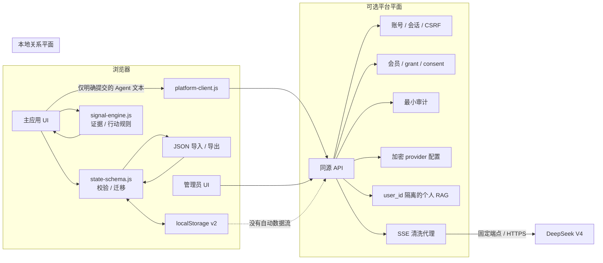

# 架构说明

## 1. 架构目标

GAME Signal Lab 采用“双平面、本地优先”架构：

- 高敏感关系日记和规则分析保持在浏览器；
- 账号、会员、授权、外部 AI 同意和最小审计由可选同源平台服务处理；
- 浏览器只在用户明确提交 Agent 消息时发送该消息，不自动附带本地关系数据；
- Node/SQLite 与 Sites Worker/D1 是同一产品契约的两个部署适配器。



## 2. 浏览器模块

### `index.html`

- 应用外壳、年龄门、主导航与 Agent 入口；
- 首页 SEO 元数据与 WebApplication 结构化数据；
- CSP 仅允许同源资源与同源连接：`connect-src 'self'`；
- 不加载第三方脚本、字体、统计或广告。

### `styles.css`

- 衬线叙事标题、无衬线控件、等宽元数据组成的电子杂志视觉系统；
- 响应式布局、移动侧栏、焦点状态与 reduced motion；
- 主应用与安全状态的统一视觉语言。

### `app.js`

- 本地视图渲染与交互编排；
- 表单处理、焦点管理、删除、导入导出；
- 本地存储写入失败回滚与恢复保护；
- 平台账号、同意和 Agent 视图编排；
- 不定义领域评分规则，也不把本地 state 交给平台客户端。

### `src/signal-engine.js`

- 纯函数领域引擎；
- 将证据强度与行动策略分开；
- 处理拒绝优先、持续回避降级和真实结果覆盖；
- 生成依据、替代解释、不确定性和安全回应；
- 不访问网络、存储、账号或 AI。

### `src/state-schema.js`

- 本地 schema v2、默认值与迁移；
- 字段、数量、枚举、日期、唯一性和 ID allowlist；
- JSON 备份解析与 20 MB 上限；
- 未来版本、有损、损坏和超量数据的恢复保护。

### `src/platform-client.js`

- 同源账号、会话、同意与 Agent API 客户端；
- 登录/注册前获取 pre-auth CSRF；
- 会话内存 CSRF 与 same-origin Cookie；
- Agent 消息大小限制和 SSE 增量解析；
- 不导入或读取 `state-schema.js`，不持有本地关系 state。

### `admin/`

- 同源 `/api/admin/v1` 控制台；
- 用户/授权、概览、审计、DeepSeek 配置和全局访问；
- 不保存 Bearer Token、密码、CSRF 或 API Key 到 URL/localStorage；
- 管理页面与 API 禁止搜索索引。

## 3. 本地关系数据流

1. UI 收集结构化输入。
2. `validateEventInput` 检查边界状态和冲突证据。
3. 事件作为源数据加入候选 state。
4. 所有事件通过当前引擎重新派生 `analysis`。
5. 完整候选 state 成功写入 `localStorage` 后，才替换内存 state。
6. 若写入失败，原内存 state 保持不变并提示用户。
7. 导出只序列化源数据；导入校验完成后才替换当前 state，并重新派生分析。

`analysis` 是运行时视图，不是事实，也不写入本地备份。加载、导入、修改个人表达或记录新结果时均按当前 `engineVersion` 重建。

## 4. 平台数据流

### 4.1 账号与会话

1. 浏览器请求 `GET /api/auth/csrf`。
2. 服务端返回签名 token，并设置 HttpOnly pre-auth Cookie。
3. 浏览器在登录/注册请求的 `X-CSRF-Token` 中回送 token。
4. 所有不安全方法必须带与当前站点完全一致的 `Origin`。
5. 登录成功后服务端设置 HttpOnly、SameSite=Strict 会话 Cookie；生产环境使用 Secure。
6. 会话 token 与 CSRF 仅以哈希形式持久化；注销撤销服务端会话。

普通账号和管理员登录共享核心防护，但管理员会话接口还验证角色。失败响应不暴露账号是否存在。

### 4.2 Agent 授权

实际调用前依次验证：

```text
provider configured and enabled
AND globalEnabled
AND (
  role == admin
  OR (
    membership == active
    AND membership not expired
    AND member grant == enabled
  )
)
AND external AI consent is current
```

provider 开关与全局授权总闸是两个独立控制。全局关闭时管理员也不能绕过；会员/grant 也不能代替外部 AI 明示同意。

### 4.3 个人知识库与 Agent 请求

默认登录、打开 Agent 或浏览本地档案都不会上传关系内容。用户在对象档案
页明确点击同步后，客户端只发送经过 allowlist 的 profile/contact/event
最少必要字段。服务端把文档写入 `user_rag_documents`，每一行都包含不可
省略的 owner `user_id`；Node 建立 FTS5 辅助索引，Sites 使用 D1 owner
过滤的有界关键词检索。

Agent 调用前先按当前会话 `user_id` 检索，不能使用客户端提供的用户 ID、
档案 ID 或 system 消息。检索结果只在本次 DeepSeek 请求内作为私有上下文，
不写入 prompt/reply 审计。用户撤回外部 AI 同意或清空知识库时，服务端
删除该用户的服务器档案；管理员不能读取正文或检索结果。

### 4.4 Agent 请求

1. 用户在 Agent 视图明确提交最少必要文本。
2. 客户端只提交受限的 `user` / `assistant` 消息；未明确同步的本地 profile、contacts、events、reviews 不参与组装。
3. 服务端以会话 `user_id` 检索已同步的个人 RAG 文档，再拒绝客户端 `system` 消息并注入固定安全提示词。
4. 服务端解密 API Key，调用固定 `https://api.deepseek.com/chat/completions`。
5. 模型只允许 `deepseek-v4-flash` 或 `deepseek-v4-pro`。
6. 上游 SSE 在服务端逐帧解析，只重新发出允许的 assistant content/role、已知结束原因和 `[DONE]`。
7. 超时、取消、畸形帧、超大帧、输出超限或缺少 `[DONE]` 时关闭失败。
8. 服务端只写调用成功/失败等审计元数据，不写 prompt/reply、系统提示、检索正文或上游原始响应。

### 4.4 管理与审计

管理员可以查看：

- 平台用户账号标识与加入时间；
- 会员状态、到期时间、个人 Agent grant；
- provider 是否配置、是否启用和所选模型；
- Agent 全局总闸；
- 账号、同意、Agent 调用与管理变更的最小审计元数据。

管理员不能查看：

- 本地 profile、关系档案、事件、分析和复盘；
- Agent prompt/reply 或系统提示词；
- 密码、API Key、解密材料；
- IP 地址、User-Agent 或自由文本审批理由。

审计结构仅包含操作者、动作、资源、结果、固定原因代码、请求 ID 和时间。安全敏感的授权、配置或策略变更与对应审计在同一事务/原子批次提交。

## 5. 部署适配器

### 5.1 Node + SQLite

入口：`server/index.js` / `server/app.js`

- Node.js `>=22.18`，使用内置 `node:sqlite`；
- 同时服务静态文件、`/runtime-config.js`、API、robots 与 sitemap；
- SQLite 位于静态发布目录之外，文件权限最小化；
- 数据库使用向前迁移，v2 迁移移除旧审计网络指纹字段；
- 密码使用 scrypt，DeepSeek API Key 使用 AES-256-GCM；
- 登录/注册频率、Agent 每用户频率与并发、全局并发和流大小均有界；
- `PUBLIC_ORIGIN` 决定精确 Origin 校验与动态 SEO URL。

### 5.2 Sites Worker + D1

入口：`sites-runtime/index.js`

- `build-sites/build-sites.mjs` 生成 `dist/server`、`dist/static`、绑定与迁移；
- D1 保存平台数据，静态关系应用仍使用浏览器 `localStorage`；
- Web Crypto 实现密码派生、HMAC token 与 AES-GCM；
- 登录/注册频率计数存入独立、有界且过期的数据表，不进入审计；
- `ASSETS` 提供静态资源，`DB` 提供 D1；
- robots/sitemap 根据部署请求 Origin 动态生成。

两个适配器的实现细节和表结构不同，但必须保持核心授权、同意、管理 API、安全输出和数据边界一致。

## 6. 静态本地模式

仓库根目录的 `runtime-config.js` 设置 `apiEnabled: false`。使用 `npm run serve` 时：

- 本地关系功能完整可用；
- 不初始化账号 API；
- Agent 视图说明平台能力未启用；
- CSP 仍为 `connect-src 'self'`，但应用逻辑不会发起平台请求。

Node 运行时动态返回 `apiEnabled: true`；Sites 构建会在产物中写入启用平台的运行时配置。

## 7. 动态 SEO

- `index.html` 提供相对 canonical、description、Open Graph、Twitter 与 JSON-LD；
- Node 使用已验证的 `PUBLIC_ORIGIN` 生成 `/robots.txt` 和 `/sitemap.xml`；
- Sites 使用当前请求的可信 Origin 生成相同资源；
- robots 禁止 `/admin/` 与 `/api/`，sitemap 只列公开首页；
- 管理页面与管理 API 响应设置 `X-Robots-Tag: noindex, nofollow, noarchive`。

## 8. 信任边界

- 用户输入、导入 JSON、Cookie、Header、管理员参数和上游 SSE 均不可信。
- 浏览器输出必须转义；服务端 JSON/SSE 只输出 allowlist 字段。
- 浏览器不能直接调用 DeepSeek，也不能指定 provider URL。
- API Key 只在服务端解密到请求生命周期，不返回浏览器。
- 简单拒绝短语检测只用于安全降级和人工复核，不用于推断兴趣。
- CSP 的同源连接许可不代表本地 state 可出站；数据流隔离由模块边界、请求构造和测试共同保证。

## 9. 错误与恢复策略

### 本地

- 损坏或未来版本 JSON：进入恢复保护；用户明确导入或清空前不覆盖；
- 旧版本：迁移为 v2，并在成功保存后移除旧键；
- 存储不可用/超额：候选修改不生效并提示；
- 非法、超量、重复、未来版本或有损导入：明确拒绝；
- 缺失分析：重新生成，不白屏。

### 平台

- 缺少数据库绑定、主密钥、公开 Origin 或首次引导秘密：拒绝启动或返回安全错误；
- Origin/CSRF/角色/授权/同意失败：不调用 provider；
- API Key 认证解密失败：关闭失败，不回退到明文或旧配置；
- 上游原始错误不直接返回浏览器；
- 审计写入失败时，关联的会话/授权/配置变更不得单独提交；
- Agent 流中断通过受控 SSE error/不完整状态呈现，不持久化半完成正文。

## 10. 秘密边界

以下值只能通过部署平台秘密管理注入：

- `CONFIG_MASTER_KEY`
- `ADMIN_BOOTSTRAP_PASSWORD`
- 生产数据库凭据或绑定

DeepSeek API Key 由管理员通过 HTTPS 控制台提交，认证加密后保存。任何真实密码、API Key、主密钥、关系正文或生产导出不得进入 Git、测试夹具、截图、日志和文档。
